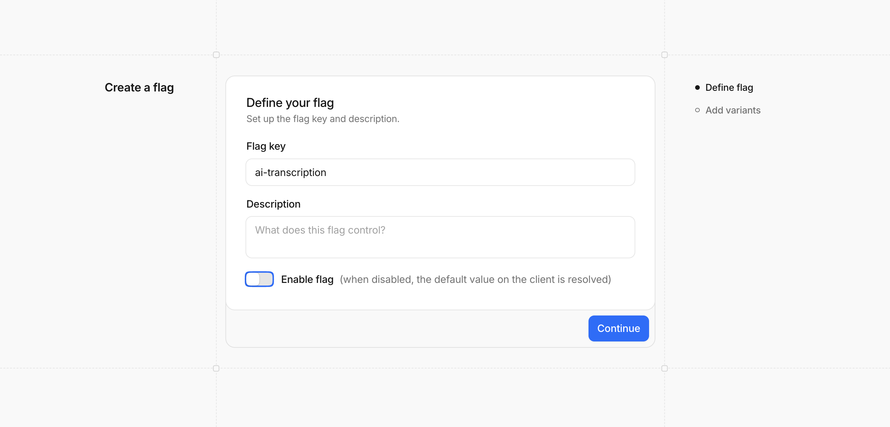
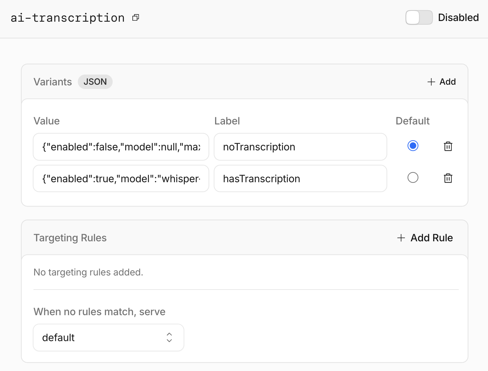
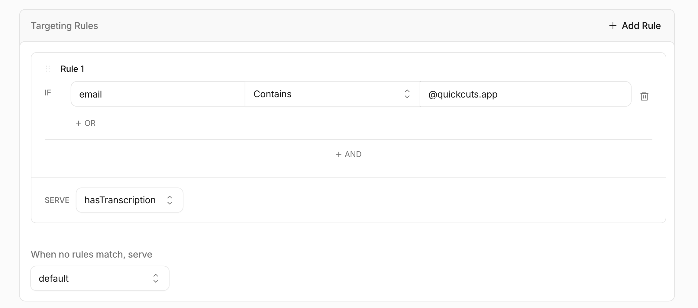
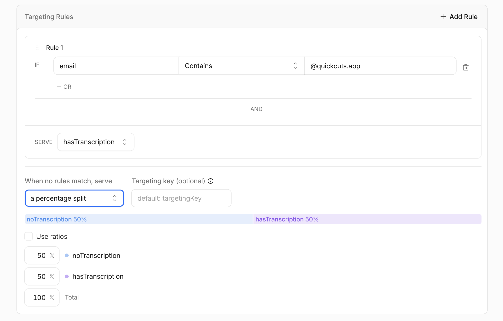
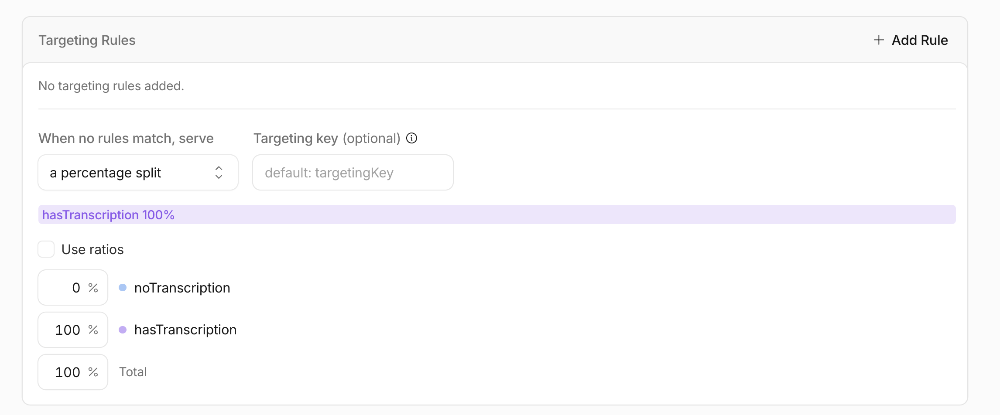
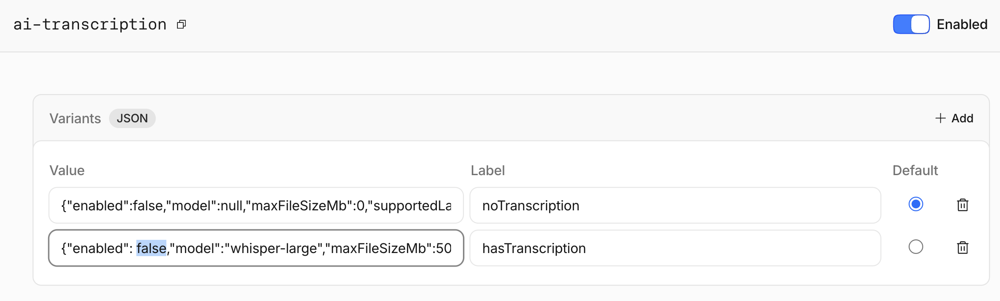

[Flagship](https://developers.cloudflare.com/flagship/), Cloudflare's feature flag service, just went into public beta. I've already got a basic implementation in my [Quick Cuts](https://quickcuts.app/) app with a stereotypical boolean flag, but I'm thinking of experimenting with a feature flag as a JSON object.

Instead of a simple on/off toggle, the flag could become the entire configuration for the feature. Here's what that might look like.

## The Feature

For context, Quick Cuts is a video collaboration app where teams upload clips, leave timestamped comments, and review footage together. The feature I'd add: when a user uploads a clip, Quick Cuts automatically generates a transcript.

The goal would be to get this to 100% of users, but not all at once. I'd want to validate transcript quality internally first, expand gradually, and be able to tune or kill the rollout at any point without pushing code.

## Why a JSON Object Flag (Not a Boolean)

You could do this with a boolean flag (`ai-transcription: true/false`) and that works fine, but it doesn't give you any control over _how_ the feature runs.

With a JSON object flag, one evaluation call returns everything your code needs:

- whether the feature is on
- which model to use
- what the file size limit is
- which languages are supported

Then, I could change any of those values in the dashboard without touching code.

## Step 1: Create the Flag (Leave It Disabled)

I'd start by creating the flag in the [Cloudflare dashboard](https://dash.cloudflare.com) before writing any code. Key: `ai-transcription`. I'd leave the **Enable flag** toggle off for now.



Then I'd define two JSON object variations: `noTranscription` (the default) and `hasTranscription`.

**`noTranscription` (default):**

```json
{
  "active": false,
  "model": null,
  "maxFileSizeMb": 0,
  "supportedLanguages": [],
  "showUiHints": false
}
```

**`hasTranscription`:**

```json
{
  "active": true,
  "model": "whisper-large",
  "maxFileSizeMb": 500,
  "supportedLanguages": ["en", "es", "fr"],
  "showUiHints": true
}
```



With the flag disabled, it always returns the `noTranscription` default variation regardless of any targeting rules. That's exactly what I'd want while the code isn't written yet.

## Step 2: Write the Code

This would be the only code change for the entire rollout. I'd define a TypeScript interface that matches the flag's JSON shape, then evaluate the flag on clip upload. `getObjectValue` takes three arguments: the flag key, a default value to fall back to if evaluation fails, and a context object containing the user attributes that targeting rules will match against.

```typescript
interface TranscriptionConfig {
  active: boolean;
  model: string | null;
  maxFileSizeMb: number;
  supportedLanguages: string[];
  showUiHints: boolean;
}

const transcription = await env.FLAGS.getObjectValue<TranscriptionConfig>(
  "ai-transcription",
  { active: false, model: null, maxFileSizeMb: 0, supportedLanguages: [], showUiHints: false },
  {
    userId: session.userId,
    plan: session.plan,
    email: session.email,
  }
);
```

Then, I could gate the actual transcript generation on the server:

```typescript
if (transcription.active && clip.fileSizeMb <= transcription.maxFileSizeMb) {
  await queueTranscriptionJob(clip.id, transcription.model);
}
```

And in the UI layer to show UI hints:

```typescript
if (transcription.showUiHints) {
  renderTranscriptPanel(clip);
}
```

Because the flag is still disabled in the dashboard, every user, including internal ones, would get the default value with `active: false`. Neither `if` condition would trigger. The feature would be live in production but completely inert.

Worth noting: `getObjectValue` never throws. If the flag isn't found, the binding is unreachable, or there's a type mismatch, it returns the default value you passed in. Your app degrades gracefully no matter what.

## Step 3: Enable for Internal Users First

With the code deployed and confirmed safe, I'd go back to the dashboard and enable the flag — but scope it tightly. I'd add a targeting rule that matches internal team members only: `email` contains `@quickcuts.app`, serving the `hasTranscription` variation.



At this point, only users with a `@quickcuts.app` email would get the `hasTranscription` variation. Everyone else falls through to the flag's default variation, `noTranscription` so the feature stays off for them. Flagship returns the default variation whenever no targeting rule matches, and for every user while the flag is disabled. This would be the first time any real user sees the feature running, so I could validate transcript quality, check UI edge cases, and watch queue behavior without any risk to external users.

If something looked wrong, I'd just disable the flag again. No deploy required.

## Step 4: Gradually Roll Out to Everyone

Once internal testing looked good, I'd expand the rollout in stages all from the dashboard with no code changes.

- Week 2 - Pro + Enterprise beta users 
- Week 3 - 20% of all users            
- Week 4 - 100%                        

Instead of a hard rule, I'd switch the "when no rules match" behavior to a percentage split and dial it up over time.



When switching to percentage rollouts, Flagship uses consistent hashing on `userId` so the same user always lands in the same bucket. They wouldn't randomly flip between seeing the feature and not. Bump that split until `hasTranscription` is serving 100%.



I could also tune the `hasTranscription` variation itself mid-rollout without touching code:

- If French transcripts came back garbled → remove `"fr"` from `supportedLanguages`
- If large files started hammering the queue → drop `maxFileSizeMb` from `500` to `200`
- If something went seriously wrong → disable the flag; everyone would immediately fall back to the `noTranscription` default



That last one is the real value of keeping both code paths live. Rollback would be instant.

## Step 5: Clean Up

Once at 100% and stable, one final code pass to:

- Remove the `getObjectValue` call and the `TranscriptionConfig` interface
- Delete the inactive (transcription-off) code path
- Archive the `ai-transcription` flag in the dashboard

That would be the second and final deploy for this feature.

## The Practical Outcome

Shipping a feature this way would mean the developer doesn't have to be in the loop for every decision about who sees it. Product can expand the rollout on a Saturday. On-call can kill it at 2am without waking anyone up. The developer touches code exactly twice: once to add the feature and once to remove the scaffolding after it's fully live. Everything in between is owned by the dashboard.

If you want to dig into the specifics, check out the [Cloudflare Flagship docs](https://developers.cloudflare.com/flagship/).
