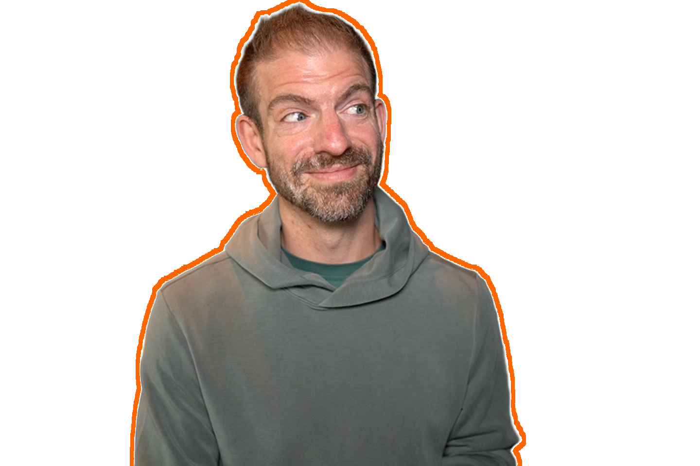
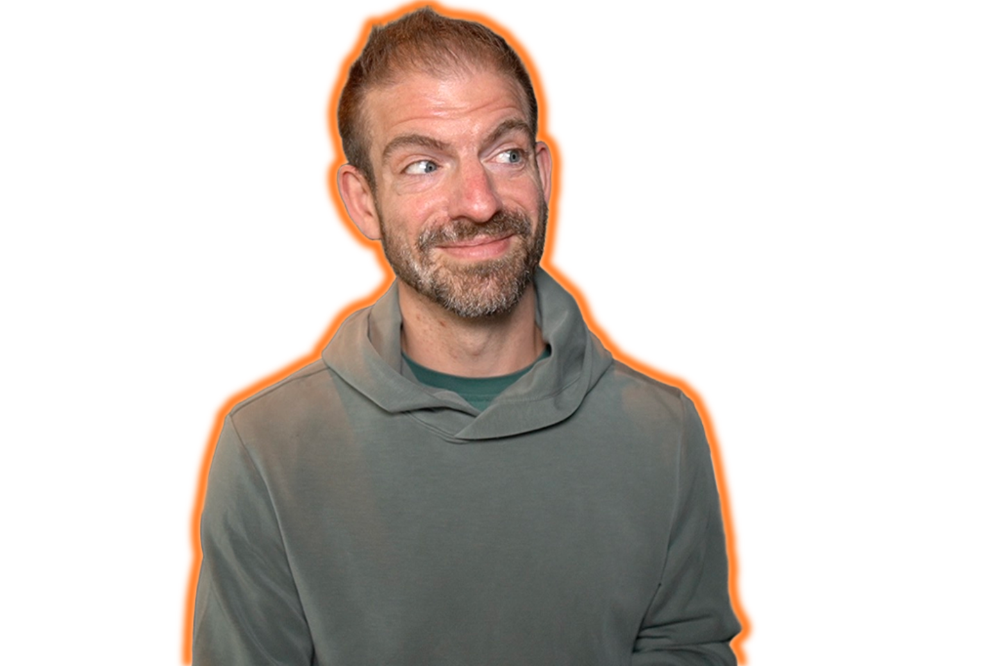

Every week I make YouTube thumbnails. Each time I open Canva, upload a selfie, remove the background, and add a colored outline around myself. It was tedious though. Seemed like something I could automate. Not to mention, I've been paying for Canva pro for this feature. I've wanted to do replace this for a while, but just hadn't gotten around to it.

Well, today I decided to do it. Here's how I build a portrait outline tool on Cloudflare Workers: what it does, how the pieces fit together, and the things that went wrong along the way.

**[Try the live demo →](https://outline-tool.examples.workers.dev)**

## What the tool does

The app takes a portrait image you upload and removes the background. Then, you get four sliders: size, blur amount, color, and intensity. Then, you can download the result as a transparent PNG.

This is the same workflow as Canva's shadow/outline feature. The difference is I own it, and it runs on infrastructure I'm already using.

## Project setup

The whole project is one Worker with two bindings:

```jsonc
// wrangler.jsonc
{
  "name": "outline-tool",
  "main": "src/index.ts",
  "compatibility_date": "2025-05-01",
  "account_id": "YOUR_ACCOUNT_ID",
  "images": {
    "binding": "IMAGES"
  },
  "assets": {
    "directory": "./public",
    "binding": "ASSETS"
  }
}
```

- **`IMAGES`** — the Cloudflare Images binding, used for background removal
- **`ASSETS`** — serves static front assets (HTML and JS) as the frontend

No separate frontend deployment. No Express server. Three files: `wrangler.jsonc`, `src/index.ts`, and `public/index.html`.

Run the following command to scaffold this yourself:

```bash
npm create cloudflare@latest -- outline-tool
cd outline-tool
npm install --save-dev @cloudflare/workers-types typescript
```

One important note before you start developing: **the Images binding requires remote mode to work locally**. Running `wrangler dev` without `--remote` gives you a local stub that silently does nothing. Add `--remote` it to your dev script:

```json
{
  "scripts": {
    "dev": "wrangler dev --remote",
    "deploy": "wrangler deploy"
  }
}
```

## Removing the background: one call to the Images binding

The Cloudflare Images binding has a `segment: "foreground"` transform that replaces the background with transparent pixels. Under the hood it runs BiRefNet via Workers AI. You don't configure it, you don't pay per-call beyond standard Workers usage, and you don't touch a Python server.

Here's the root handler that forwards the incoming request to the `handleSegment` function.

```typescript
// src/index.ts
const MAX_BYTES = 10 * 1024 * 1024; // 10 MB

interface Env {
  IMAGES: ImagesBinding;
  ASSETS: Fetcher;
}

export default {
  async fetch(request: Request, env: Env): Promise<Response> {
    const url = new URL(request.url);

    if (request.method === "POST" && url.pathname === "/segment") {
      return handleSegment(request, env);
    }

    return env.ASSETS.fetch(request);
  },
} satisfies ExportedHandler<Env>;
```

The `handleSegment` handler accepts a multipart image upload, validates it, and runs the transform:

```typescript
async function handleSegment(request: Request, env: Env): Promise<Response> {
  const formData = await request.formData();
  const entry = formData.get("image");

  if (entry === null || typeof entry === "string") {
    return jsonError(400, "Missing 'image' field — must be a file upload");
  }
  const file = entry as unknown as File;

  const allowedTypes = ["image/jpeg", "image/png", "image/webp", "image/gif"];
  if (!allowedTypes.includes(file.type)) {
    return jsonError(415, `Unsupported image type: ${file.type}`);
  }

  if (file.size > MAX_BYTES) {
    return jsonError(413, `Image too large. Max is 10 MB`);
  }

  // Strip the background — this is the whole thing
  const result = await env.IMAGES
    .input(file.stream() as ReadableStream<Uint8Array>)
    .transform({ segment: "foreground" })
    .output({ format: "image/png" });

  const segmented = result.response();

  if (!segmented.ok) {
    const text = await segmented.text();
    return jsonError(502, `Segmentation failed (${segmented.status}): ${text}`);
  }

  return new Response(segmented.body, {
    headers: {
      "Content-Type": "image/png",
      "Cache-Control": "no-store",
    },
  });
}
```

The binding chain is the important part: `.input()` takes a `ReadableStream`, `.transform({ segment: "foreground" })` registers the operation, `.output({ format: "image/png" })` executes it and returns a result object, and `.response()` gives you a standard `Response` ready to return.

Note that `.output()` returns a `Promise<ImageTransformationResult>` — you have to `await` it before calling `.response()`. I tripped over this when I first looked at the type signature.

## The frontend: drawing the outline on a canvas

Workers Assets serves `public/index.html` directly from the same Worker. The frontend POSTs to `/segment`, gets a transparent PNG back, decodes it into an `ImageBitmap`, and draws the outline on a `<canvas>`.

### Why the first approach looked bad

My (Claude's) first attempt at the outline used a box dilation: for every transparent pixel, check a square neighborhood of radius `thickness` and paint it the outline color. Whatever that means…

Regardless, it looked terrible. On curved edges (a face, a shoulder, hair) a square kernel leaves gaps in diagonal areas. The outline didn't follow the shape, and it looked poor.



### The fix: Euclidean distance transform

My (Claude's) second approach was to use a Euclidean distance transform. For every transparent pixel, compute the exact circular distance to the nearest foreground pixel. If that distance is less than or equal to `size`, paint it.

```javascript
// Build a binary foreground mask
const fg = new Uint8Array(w * h);
for (let i = 0; i < w * h; i++) {
  fg[i] = srcData[i * 4 + 3] > 127 ? 1 : 0;
}

const INF = w * w + h * h + 1;
const dist2 = new Float32Array(w * h).fill(INF);

// Pass 1: vertical — distance to nearest fg pixel in each column
const colDist = new Float32Array(h);
for (let x = 0; x < w; x++) {
  let d = INF;
  for (let y = 0; y < h; y++) {
    d = fg[y * w + x] ? 0 : (d === INF ? INF : d + 2 * Math.sqrt(d) + 1);
    colDist[y] = d;
  }
  d = INF;
  for (let y = h - 1; y >= 0; y--) {
    d = fg[y * w + x] ? 0 : (d === INF ? INF : d + 2 * Math.sqrt(d) + 1);
    colDist[y] = Math.min(colDist[y], d);
  }
  for (let y = 0; y < h; y++) dist2[y * w + x] = colDist[y];
}

// Paint the stroke ring
const size2 = size * size;
for (let i = 0; i < w * h; i++) {
  if (fg[i] === 0 && dist2[i] <= size2) {
    ringPx[i * 4]     = r;
    ringPx[i * 4 + 1] = g;
    ringPx[i * 4 + 2] = b;
    ringPx[i * 4 + 3] = 255;
  }
}
```

The result is a perfectly circular stroke that follows every curve uniformly at any thickness.



### Blur and intensity as post-processing

Once the hard ring is painted, blur and intensity are straightforward:

```javascript
// Blur: apply a CSS filter to the hard ring on an offscreen canvas
if (blur > 0) {
  const offBlur = new OffscreenCanvas(pw, ph);
  const ctxBlur = offBlur.getContext("2d");
  ctxBlur.filter = `blur(${blur}px)`;
  ctxBlur.drawImage(offHard, pad, pad);
}

// Intensity: globalAlpha when drawing the stroke layer
ctx.globalAlpha = intensity / 100;
ctx.drawImage(strokeLayer, -pad, -pad);

// Subject on top at full opacity
ctx.globalAlpha = 1;
ctx.drawImage(bitmap, 0, 0);
```

Blur is applied *after* the hard ring is built, so `blur: 0` is a genuinely crisp edge. This is what Canva's "Blur amount" control does.

## Deploying

Deploying is simple.

```bash
npx wrangler deploy
```

One command. Frontend and API together.

Before deploying, make sure Image Transformations is enabled on your Cloudflare account (Images → Transformations in the dashboard). The `segment: "foreground"` transform won't work without it.

## What I took away from this

Pretty quick and easy and now I can remove that Canva subscription!

The live demo is at [outline-tool.examples.workers.dev](https://outline-tool.examples.workers.dev). Try it with a headshot.

---

**Resources:**

- [Cloudflare Images binding docs](https://developers.cloudflare.com/images/optimization/transformations/bindings/)
- [Images features — `segment` parameter](https://developers.cloudflare.com/images/optimization/features/#segment)
- [Source code](https://github.com/jamesqquick/outline-tool)
