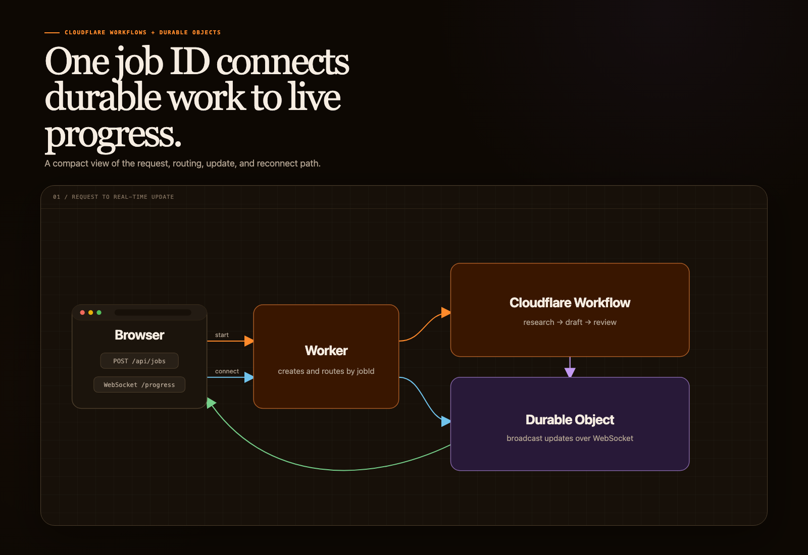

Maybe I’m a nerd, but Cloudflare Workflows is one of my favorite products. They allow you to create durable execution of processes that have multiple steps. You define each step and some retry logic, and it handles the rest for you.

It’s not the most exciting technology in many ways, but it’s an essential part of every app I build. A couple of examples:

A receipt tracking app that:

- uploads an image
- runs OCR to parse data
- saves the data to the database

A photo booth app:

- uploads an image
- runs AI scan to flag inappropriate content
- adds a watermark as an overlay

Everything I build recently has a workflow that fits…well, Cloudflare Workflows. However, the missing piece is how to give real-time feedback to the user while that work is happening. They want to know, not only that the work is happening, but what step it’s currently working on.

In this article, I’ll show you how to use Cloudflare’s Durable Objects to provide real-time updates for Workflows. We’ll specifically show snippets relevant to an application that generates blog posts from user input so you’ll see statuses like:

- researching
- writing
- reviewing

This article assumes you have basic understanding of Workflows and Durable Objects. If not, please check the docs.

## The gap in real-time updates



For the purposes of this article, a Workflow is triggered by an HTTP call from the app running in the browser. In the blog generation example, this happens when the user clicks “Generate Blog Post”. This HTTP request does not stay open for the entirety of the workflow. Instead, the Worker starts a Workflow and responds with an instance ID.

With this ID, it’s relatively easy to implement polling for updates. The browser can poll the status of a running workflow through another endpoint, but it only gives you periodic snapshots. It also does not define the application-specific progress messages your UI needs.

To handle real-time status updates, the browser needs to open a WebSocket connection. To manage that connection and publish updates, we’re going to use Cloudflare Durable Objects.

## Configure the bindings

Before looking at the routes, you’ll need to define bindings in your `wrangler.jsonc` file for both your Workflow and your Durable Objects. The Workflow binding is `BLOG_WORKFLOW`. The Durable Object binding is `PROGRESS_ROOM`, which points to the `ProgressRoom` class which you’ll see in a second.

If you’re new to bindings, I would go and check the [Bindings documentation](https://developers.cloudflare.com/workers/runtime-apis/bindings/).

```jsonc
{
  "$schema": "./node_modules/wrangler/config-schema.json",
  "name": "workflow-progress-demo",
  "main": "src/index.ts",
  "compatibility_date": "2026-08-01",
  "workflows": [
    {
      "name": "blog-workflow",
      "binding": "BLOG_WORKFLOW",
      "class_name": "BlogWorkflow"
    }
  ],
  "durable_objects": {
    "bindings": [
      {
        "name": "PROGRESS_ROOM",
        "class_name": "ProgressRoom"
      }
    ]
  },
  "migrations": [
    {
      "tag": "v1",
      "new_sqlite_classes": ["ProgressRoom"]
    }
  ]
}
```

Use a current compatibility date when creating the project. Durable Object RPC requires a compatibility date of `2024-04-03` or later.

## Use one ID to address the job

For consistency in tracking real-time updates, we generate a unique UUID for each Workflow job. The same value identifies the Workflow instance and the Durable Object that carries its progress.

```typescript
const jobId = crypto.randomUUID();
```

Use that ID in the Worker fetch handler for `POST /api/jobs`:

```typescript
export default {
  async fetch(request: Request, env: Env): Promise<Response> {
    const url = new URL(request.url);

    if (request.method === "POST" && url.pathname === "/api/jobs") {
      const { prompt } = await request.json<{ prompt: string }>();
      const jobId = crypto.randomUUID();

      const instance = await env.BLOG_WORKFLOW.create({
        id: jobId,
        params: { prompt },
      });

      return Response.json({ jobId: instance.id });
    }

    return new Response("Not found", { status: 404 });
  },
};
```

This example leaves out authentication and input validation. In a production application, verify the caller before creating the job and record which user owns the `jobId`.

The client application in the browser starts the job by sending a `POST` request to `/api/jobs`. It then parses the `jobId` from the response body and creates a new WebSocket against `/api/progress` with `jobId` as a query parameter.

```typescript
const response = await fetch("/api/jobs", {
  method: "POST",
  headers: { "content-type": "application/json" },
  body: JSON.stringify({ prompt }),
});

if (!response.ok) {
  throw new Error(`Failed to start workflow: ${response.status}`);
}

const body: unknown = await response.json();

if (
  !body ||
  typeof body !== "object" ||
  !("jobId" in body) ||
  typeof body.jobId !== "string"
) {
  throw new Error("Invalid job response");
}

const { jobId } = body;
const protocol = location.protocol === "https:" ? "wss" : "ws";

const socket = new WebSocket(
  `${protocol}://${location.host}/api/progress?jobId=${encodeURIComponent(jobId)}`,
);
```

## Route the WebSocket to a Durable Object

The Worker handles this as `GET /api/progress`. It validates the request, finds the Durable Object through the `PROGRESS_ROOM` binding, and forwards the WebSocket upgrade. Add this branch to the same `fetch` handler:

```typescript
if (request.method === "GET" && url.pathname === "/api/progress") {
  const jobId = url.searchParams.get("jobId");

  if (!jobId) {
    return new Response("Missing jobId", { status: 400 });
  }

  if (request.headers.get("Upgrade")?.toLowerCase() !== "websocket") {
    return new Response("Expected WebSocket upgrade", { status: 426 });
  }

  const room = env.PROGRESS_ROOM.getByName(jobId);
  return room.fetch(request);
}
```

[`getByName()`](https://developers.cloudflare.com/durable-objects/api/namespace/#getbyname) returns a stub for one globally unique (by `jobId`) Durable Object. Calling `room.fetch()` activates that object when necessary and passes it the WebSocket upgrade request.

Keep in mind that in a production application, this route also needs authorization. A UUID makes a job difficult to guess, but it does not prove that the current user owns the job. Check ownership before returning the Durable Object response. I’ll leave that for you to implement yourself.

## WebSocket setup with Durable Objects

When the Durable Object accepts the WebSocket, it sends the most recent progress update before it waits for another message. Build that behavior one piece at a time. These snippets come from `src/index.ts`, the file named by `main` in the `wrangler.jsonc` example.

Start by extending the Durable Object class and defining the TypeScript type for the updates that we will send. Notice the name of this class, `ProgressRoom`, matches the `class_name` value from the Wrangler binding.

```typescript
// src/index.ts
import { DurableObject } from "cloudflare:workers";

type ProgressUpdate = {
  stage:
    | "research"
    | "outline"
    | "draft"
    | "review"
    | "complete"
    | "failed"
    | "cancelled";
  stageIndex: number;
  message: string;
  percentage: number;
};

export class ProgressRoom extends DurableObject<Env> {}
```

The UI can map internal stages such as `research`, `draft`, and `review` to labels such as "researching", "writing", and "reviewing".

The Durable Object runtime provides storage and WebSocket methods through `this.ctx`. Handle the WebSocket upgrade in `fetch()` by calling `this.ctx.acceptWebSocket()`.

Each code block below replaces the previous version of the class. Do not paste the class declarations together.

```typescript
export class ProgressRoom extends DurableObject<Env> {
  async fetch(request: Request): Promise<Response> {
    if (request.headers.get("Upgrade")?.toLowerCase() !== "websocket") {
      return new Response("Expected WebSocket upgrade", { status: 426 });
    }

    const [client, server] = Object.values(new WebSocketPair());
    this.ctx.acceptWebSocket(server);

    return new Response(null, {
      status: 101,
      webSocket: client,
    });
  }
}
```

[`acceptWebSocket()`](https://developers.cloudflare.com/durable-objects/api/state/#acceptwebsocket) registers the server side of the connection with the Durable Object. The server can send the stored update before `fetch()` returns. Cloudflare accepts the server socket first and holds the frame until the `101` response completes the browser handshake. The browser then receives it through its `message` handler.

## Sharing the latest update through WebSocket

With the basic WebSocket in place, consider what happens when the browser needs to reconnect. Without stored state, it would not receive another status update until the next update is sent. Store the latest update and send it to each newly accepted WebSocket connection.

Use `ctx.storage`, the Durable Object's built-in persistent key-value storage. The `update()` method writes the current update under the `latest` key. Update the `fetch()` handler to read that value.

```typescript
async fetch(request: Request): Promise<Response> {
  if (request.headers.get("Upgrade")?.toLowerCase() !== "websocket") {
    return new Response("Expected WebSocket upgrade", { status: 426 });
  }

  const [client, server] = Object.values(new WebSocketPair());
  this.ctx.acceptWebSocket(server);

  const latest =
    await this.ctx.storage.get<ProgressUpdate>("latest");

  if (latest) {
    server.send(JSON.stringify(latest));
  }

  return new Response(null, {
    status: 101,
    webSocket: client,
  });
}
```

## Adding the update method

Now the Workflow needs a way to ask the Durable Object to publish status updates. Add a public `update()` method to the Durable Object. It saves the latest update to [`ctx.storage`](https://developers.cloudflare.com/durable-objects/api/state/#storage) and broadcasts it to connected sockets.

```typescript
async update(update: ProgressUpdate): Promise<void> {
  await this.ctx.storage.put("latest", update);
  const message = JSON.stringify(update);

  for (const socket of this.ctx.getWebSockets()) {
    if (socket.readyState === WebSocket.OPEN) {
      socket.send(message);
    }
  }
}
```

## Publish progress from the Workflow

To complete the cycle, call the `update()` method from each Workflow step. Public instance methods on the exported Durable Object class are available through the stub returned by the Durable Object binding. The Durable Object's `fetch()` method is different: `room.fetch(request)` invokes it as an HTTP handler. With a reference to `room`, call `update()` like this:

```typescript
const room = this.env.PROGRESS_ROOM.getByName(event.instanceId);

await room.update({
  stage: "research",
  stageIndex: 0,
  message: "Finding useful sources",
  percentage: 20,
});
```

For reference, here’s an abbreviated version of the blog creation Workflow showing the first `research` step.

```typescript
import {
  WorkflowEntrypoint,
  type WorkflowEvent,
  type WorkflowStep,
} from "cloudflare:workers";

type BlogWorkflowParams = {
  prompt: string;
};

export class BlogWorkflow extends WorkflowEntrypoint<
  Env,
  BlogWorkflowParams
> {
  async run(
    event: WorkflowEvent<BlogWorkflowParams>,
    step: WorkflowStep,
  ) {
    return step.do("research", async () => {
      return researchTopic(event.payload.prompt);
    });
  }
}
```

Get a reference to the Durable Object by passing `event.instanceId`, the UUID created earlier. Then add the call to the `update()` method.

```typescript
const room = this.env.PROGRESS_ROOM.getByName(
  event.instanceId,
);

const research = await step.do("research", async () => {
  await room.update({
    stage: "research",
    stageIndex: 0,
    message: "Finding useful sources",
    percentage: 20,
  });

  return researchTopic(event.payload.prompt);
});
```

Add a final step that publishes `complete` when the Workflow finishes. Publish `failed` from a catch handler when a step fails. Treat `cancelled` as a Workflow status that the client observes separately, because a terminated Workflow may not run cleanup code. A reconnected browser should not wait for another progress update that will never arrive.

```typescript
await step.do("complete", async () => {
  await room.update({
    stage: "complete",
    stageIndex: 4,
    message: "Your post is ready",
    percentage: 100,
  });
});
```

`step.do()` retries the entire callback when it fails. If `researchTopic()` fails after `room.update()` succeeds, the Workflow publishes the same progress state again and retries the research work. Keep the work safe to repeat, and publish absolute progress values so repeated updates have the same result.

This is one step in the sample workflow. The other steps use the same pattern, with each step responsible for updating the status.

The UI can now listen for each update and render it appropriately.

```typescript
type ProgressUpdate = {
  stage:
    | "research"
    | "outline"
    | "draft"
    | "review"
    | "complete"
    | "failed"
    | "cancelled";
  stageIndex: number;
  message: string;
  percentage: number;
};

socket.addEventListener("message", (event) => {
  const update = JSON.parse(event.data) as ProgressUpdate;
  renderProgress(update);
});
```

In a real application, keep this type in a shared module so the Worker and browser use the same stage values. Validate the parsed message at runtime before rendering it; the type assertion only affects TypeScript and does not validate data from the network.

## Wrap up

Real-time progress is one use case for Durable Objects. They can combine WebSocket connections with persistent state for background work. If you have another use case you’d like to see, let me know!

Read the [Cloudflare Workflows documentation](https://developers.cloudflare.com/workflows/) and the [Durable Objects WebSocket guide](https://developers.cloudflare.com/durable-objects/best-practices/websockets/) for the complete APIs.
